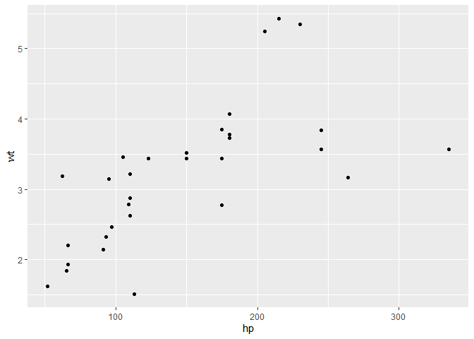
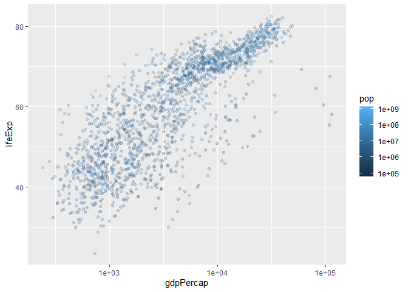
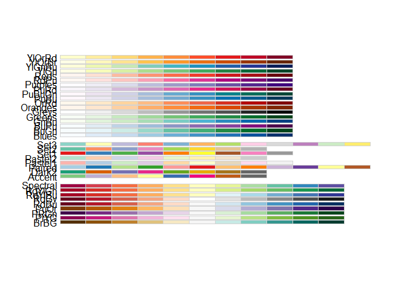
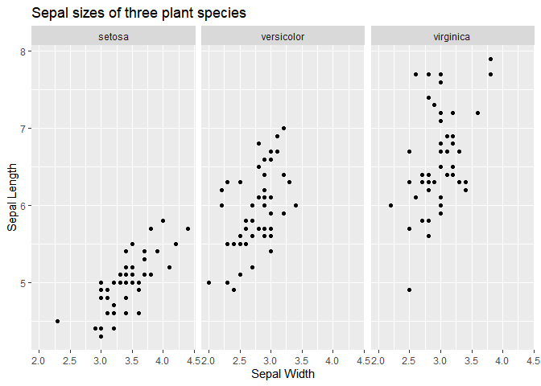
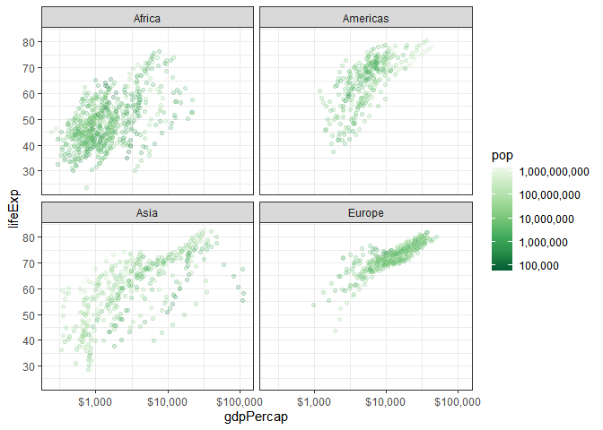

```r
suppressPackageStartupMessages(library(tidyverse))
library(gapminder)
```


# Saving Graphs to File

- Don't use the mouse
- Use `ggsave` for ggplot
    - Practice by saving the following plot to file: 


```r
ggplot(mtcars, aes(hp, wt)) + 
    geom_point()
```

<!-- -->

```r
ggsave(FILENAME_HERE, PLOT_OBJECT_HERE)
```

```
## Error in force(filename): object 'FILENAME_HERE' not found
```

- Base R way: print plots "to screen", sandwiched between `pdf()`/`jpeg()`/`png()`... and `dev.off()`. 
- Vector vs. raster: Images are stored on your computer as either _vector_ or _raster_.
    - __Raster__: an `n` by `m` grid of pixels, each with its own colour. `jpeg`, `png`, `gif`, `bmp`.
    - __Vector__: represented as shapes and lines. `pdf`, [`svg`](https://www.w3schools.com/graphics/svg_intro.asp).
    - For tips: ["10 tips for making your R graphics look their best""](http://blog.revolutionanalytics.com/2009/01/10-tips-for-making-your-r-graphics-look-their-best.html).
    
# Scales; Color

Scale functions in `ggplot2` take the form `scale_[aesthetic]_[mapping]()`.

Let's first focus on the following plot:


```r
p_scales <- ggplot(gapminder, aes(gdpPercap, lifeExp)) +
     geom_point(aes(colour=pop), alpha=0.2)
p_scales + 
    scale_x_log10() +
    scale_colour_continuous(trans="log10")
```

<!-- -->

1. Change the y-axis tick mark spacing to 10; change the colour spacing to include all powers of 10.


```r
p_scales +
    scale_x_log10() +
    scale_colour_continuous(
        trans  = "log10", 
        breaks = FILL_IN_BREAKS
    ) +
    FILL_IN_SCALE_FUNCTION(breaks=FILL_IN_BREAKS)
```

```
## Error in check_breaks_labels(breaks, labels): object 'FILL_IN_BREAKS' not found
```

2. Specify `scales::*_format` in the `labels` argument of a scale function to do the following:
    - Change the x-axis labels to dollar format (use `scales::dollar_format()`)
    - Change the colour labels to comma format (use `scales::comma_format()`)


```r
library(scales)
```

```
## 
## Attaching package: 'scales'
```

```
## The following object is masked from 'package:purrr':
## 
##     discard
```

```
## The following object is masked from 'package:readr':
## 
##     col_factor
```

```r
p_scales +
    scale_x_log10(labels=FILL_THIS_IN) +
    scale_colour_continuous(
        trans  = "log10", 
        breaks = 10^(1:10),
        labels = FILL_THIS_IN
    ) +
    scale_y_continuous(breaks=10*(1:10))
```

```
## Error in check_breaks_labels(breaks, labels): object 'FILL_THIS_IN' not found
```

3. Use `RColorBrewer` to change the colour scheme.
    - Notice the three different types of scales: sequential, diverging, and continuous.


```r
## All palettes the come with RColorBrewer:
RColorBrewer::display.brewer.all()
```

<!-- -->

```r
p_scales +
    scale_x_log10(labels=dollar_format()) +
    FILL_IN_WITH_RCOLORBREWER(
        trans   = "log10",
        breaks  = 10^(1:10),
        labels  = comma_format(),
        palette = FILL_THIS_IN
    ) +
    scale_y_continuous(breaks=10*(1:10))
```

```
## Error in FILL_IN_WITH_RCOLORBREWER(trans = "log10", breaks = 10^(1:10), : could not find function "FILL_IN_WITH_RCOLORBREWER"
```

4. Use `viridis` to change the colour to a colour-blind friendly scheme
    - Hint: add `scale_colour_viridis_c` (`c` stands for continuous; `d` discrete).
    - You can choose a palette with `option`.


```r
p_scales +
    scale_x_log10(labels=dollar_format()) +
    FILL_IN_WITH_RCOLORBREWER(
        trans   = "log10",
        breaks  = 10^(1:10),
        labels  = comma_format(),
        palette = FILL_THIS_IN
    ) +
    scale_y_continuous(breaks=10*(1:10))
```

```
## Error in FILL_IN_WITH_RCOLORBREWER(trans = "log10", breaks = 10^(1:10), : could not find function "FILL_IN_WITH_RCOLORBREWER"
```

# Theming

Changing the look of a graphic can be achieved through the `theme()` layer.

There are ["complete themes"](http://ggplot2.tidyverse.org/reference/ggtheme.html) that come with `ggplot2`, my favourite being `theme_bw` (I've grown tired of the default gray background, so `theme_bw` is refreshing).

1. Change the theme of the following plot to `theme_bw()`:


```r
ggplot(iris, aes(Sepal.Width, Sepal.Length)) +
     facet_wrap(~ Species) +
     geom_point() +
     labs(x = "Sepal Width",
          y = "Sepal Length",
          title = "Sepal sizes of three plant species")
```

<!-- -->

2. Then, change font size of axis labels, and the strip background colour. Others?


```r
ggplot(iris, aes(Sepal.Width, Sepal.Length)) +
     facet_wrap(~ Species) +
     geom_point() +
     labs(x = "Sepal Width",
          y = "Sepal Length",
          title = "Sepal sizes of three plant species") +
    theme_bw() +
    theme(FILL_IN_ARG_FOR_AXIS_TITLE = FILL_THIS_IN,
          strip.background = FILL_THIS_IN)
```

```
## Error in mget(args, envir = env): object 'FILL_THIS_IN' not found
```


# Plotly (optional)

Consider the following plot:


```r
(p <- gapminder %>% 
     filter(continent != "Oceania") %>% 
     ggplot(aes(gdpPercap, lifeExp)) +
     geom_point(aes(colour=pop), alpha=0.2) +
     scale_x_log10(labels=dollar_format()) +
     scale_colour_distiller(
         trans   = "log10",
         breaks  = 10^(1:10),
         labels  = comma_format(),
         palette = "Greens"
     ) +
     facet_wrap(~ continent) +
     scale_y_continuous(breaks=10*(1:10)) +
     theme_bw())
```

<!-- -->

1. Convert it to a `plotly` object by applying the `ggplotly()` function:


```r
FILL_THIS_IN
```

```
## Error in eval(expr, envir, enclos): object 'FILL_THIS_IN' not found
```

2. You can save a plotly graph locally as an html file. Try saving the above:
    - NOTE: plotly graphs don't seem to show up in Rmd _notebooks_, but they do with Rmd _documents_.


```r
p %>% 
    ggplotly() %>% 
    htmlwidgets::saveWidget("LOCATION_GOES_HERE")
```

```
## Error in ggplotly(.): could not find function "ggplotly"
```


3. Run this code to see the json format underneath:


```r
p %>% 
    ggplotly() %>% 
    plotly_json()
```

```
## Error in ggplotly(.): could not find function "ggplotly"
```


4. Check out code to make a plotly object from scratch using `plot_ly()` -- scatterplot of gdpPercap vs lifeExp.
    - Check out the [cheat sheet](https://images.plot.ly/plotly-documentation/images/r_cheat_sheet.pdf).


```r
plot_ly(gapminder, 
        x = ~gdpPercap, 
        y = ~lifeExp, 
        type = "scatter",
        mode = "markers",
        opacity = 0.2) %>% 
    layout(xaxis = list(type = "log"))
```

```
## Error in plot_ly(gapminder, x = ~gdpPercap, y = ~lifeExp, type = "scatter", : could not find function "plot_ly"
```

5. Add population to form a z-axis for a 3D plot:


```r
plot_ly(gapminder, 
        x = ~gdpPercap, 
        y = ~lifeExp, 
        z = FILL_THIS_IN,
        type = "scatter3d",
        mode = "markers",
        opacity = 0.2)
```

```
## Error in plot_ly(gapminder, x = ~gdpPercap, y = ~lifeExp, z = FILL_THIS_IN, : could not find function "plot_ly"
```


