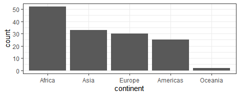
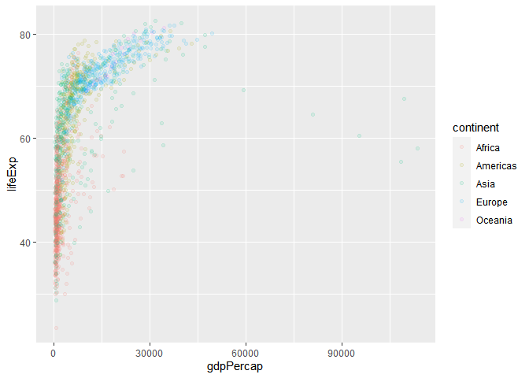
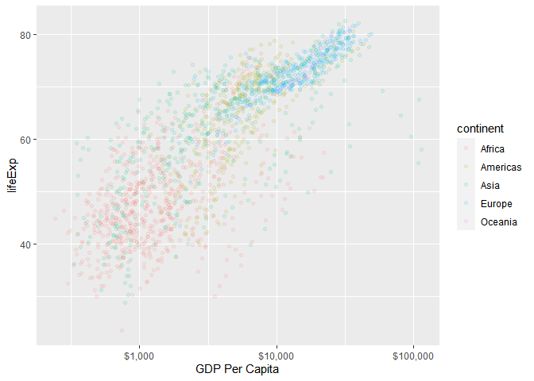

# Participation Activities Jan 30th 2020

## Installation and Set Up

```r
#install.packages("tidyverse")
#install.packages("scales")
#install.packages("tibble")

suppressPackageStartupMessages(library(tidyverse))
suppressPackageStartupMessages(library(gapminder))
suppressPackageStartupMessages(library(scales))
```

<!---The following chunk allows errors when knitting--->


## Activity 1


In this seciton Dr. Wiernik showed us an example and then walked us through how to make one.
 
Example


```r
ggplot(gapminder, aes(gdpPercap, lifeExp)) +
  geom_point(alpha = 0.1) +
  scale_x_log10("GDP per capita", labels = scales::dollar_format()) +
  theme_bw() +
  ylab("Life Expectancy")
```

<!-- -->


In class Practice - Naming Components


```r
gapminder %>% 
  filter(year==2007) %>% 
  mutate(continent=fct_infreq(continent)) %>% 
  ggplot(aes(continent)) +
  geom_bar() +
  theme_bw()
```

<!-- -->

With the output plot
| Grammar Component     | Specification |
|-----------------------|---------------|
| __data__              | `gapminder`  |
| __aesthetic mapping__ |              |
| __geometric object__  | Bar          |
| scale                 | Linear       |
| statistical transform | none         |
| coordinate system     | rectangular  |
| facetting             | none         |

~~~~~~~~~~~~~~~~~~~~~~~~~~~~~

Class Walkthrough of a Making Scatter Plot- see notes

Step 1 - The Basics
this makes a plot


```r
ggplot(gapminder, aes(gdpPercap, lifeExp))
```

<!-- -->

Step 2 - geom_point
this adds the data


```r
ggplot(gapminder, aes(gdpPercap, lifeExp)) +
  geom_point()
```

<!-- -->


Step 3 - Alpha and Color
this adds color and transparency


```r
ggplot(gapminder, aes(gdpPercap, lifeExp)) +
  geom_point(alpha =.1, aes(color = continent))
```

<!-- -->

Step 4 - Scale 
this changes scale


```r
ggplot(gapminder, aes(gdpPercap, lifeExp)) +
  geom_point(alpha =.1, aes(color = continent)) +
  scale_x_log10()
```

<!-- -->

using log 10 transformation - not sure what that math is..? It's fine.

Step 5 - Specifying Scale and Label
specifications


```r
ggplot(gapminder, aes(gdpPercap, lifeExp)) +
  geom_point(alpha =.1, aes(color = continent)) +
  scale_x_log10("GDP per capita", labels=scales::dollar_format())
```

<!-- -->
  

Okay Cool! We're happy with this! Now... Lets make it prettier.

Step 6 - Theme & Adding $ to GDP
details

```r
ggplot(gapminder, aes(gdpPercap, lifeExp)) +
  geom_point(alpha =.1, aes(color=continent)) +
  scale_x_log10("GDP Per Capita", labels=scales::dollar_format()) +
  theme_grey()
```

<!-- -->

Step 7 - Naming Y Axis
pretty self explanatory


```r
ggplot(gapminder, aes(gdpPercap, lifeExp)) +
  geom_point(alpha =.1, aes(color=continent)) +
  scale_x_log10("GDP Per Capita", labels=scales::dollar_format()) +
  theme_grey() +
  ylab("Life Expectancy")
```

<!-- -->


Step 8 - Figure Size
size

```r
ggplot(gapminder, aes(gdpPercap, lifeExp)) +
  geom_point(alpha =.1, aes(color=continent)) +
  scale_x_log10("GDP Per Capita", labels=scales::dollar_format()) +
  theme_grey() +
  ylab("Life Expectancy")
```

<!-- -->

## Activity 2

For this section, we did the same thing as above, just on our own.

### 2(a) - Write Your Own!

Write a plot: Specifically, the plot should have the following grammar components:

| Grammar Component     | Specification |
|-----------------------|---------------|
| __data__              | `mauna` |
| __aesthetic mapping__ | x: month, y: conc |
| __geometric object__  | lines |
| scale                 | linear |
| statistical transform | none |
| coordinate system     | rectangular |
| facetting             | none |

#### Opening Mauna - 


```r
(mauna <- tsibble::as_tsibble(co2) %>%    #this chunk opens the mauna kea data set and renames the variables
   rename(month = index, conc = value))
```

```
## Error in loadNamespace(name): there is no package called 'tsibble'
```

#### Making the plot - 


```r
ggplot (mauna, aes(month, conc)) +    #this chunk makes the plot
  geom_line() +
  theme_classic() 
```

```
## Error in ggplot(mauna, aes(month, conc)): object 'mauna' not found
```


### 2(b)- Fix The Code

Code Provided:
{r, fig.with = 5, fig.height = 2}
ggplot(mauna, aes(y = month)) +
  geom_line(aes(FILL_THIS_IN))

The problem is that you're only setting the y variable. The fixed code sets both.

Fixed:

```r
ggplot(mauna, aes(month, conc)) +   
  geom_line()
```

```
## Error in ggplot(mauna, aes(month, conc)): object 'mauna' not found
```


### 2(c) - Storing & P

You can store the output of the plot in a variable, too. Store the plot from 2(a) in the variable named `p`, then add a layer to `p` that adds green points to the plot.


```r
p<-ggplot (mauna, aes(month, conc)) +
  geom_line() +
  theme_classic() 
```

```
## Error in ggplot(mauna, aes(month, conc)): object 'mauna' not found
```

```r
p +
  geom_point(color="green")
```

```
## Error in eval(expr, envir, enclos): object 'p' not found
```

### 2(d)

What's wrong with the following code? Fix it.

Code Provided:
{r, fig.width = 5, fig.height = 2}
ggplot(gapminder) +
  geom_point(x = gdpPercap, y = lifeExp, alpha = 0.1)

The problem with this code is that it sets the x and y variables in the individual plot. It's better to set these in the aesthetic.

Fixed:

```r
ggplot(gapminder, aes(gdpPercap, lifeExp))+
  geom_point(alpha = 0.1)
```

<!-- -->


### 2(e) BONUS

So you're a ggplot2 pro? Then, let's see this plot adapted to polar coordinates. Specifically:

- angle is month (January through December)
- radius is CO$_2$ concentration

The plot should look like a spiral, or concentric circles. 


```r
ggplot (mauna, aes(month, conc)) +
  geom_????(angle=month.abb, radius=co2) +
  theme_classic() 
```

```
## Error: <text>:2:28: unexpected ','
## 1: ggplot (mauna, aes(month, conc)) +
## 2:   geom_????(angle=month.abb,
##                               ^
```
