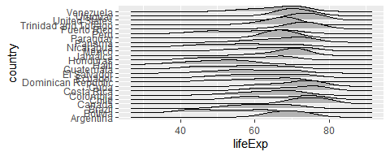

# Activity 2

In this worksheet, we fix some incorrect plots.

## Set Up

In this worksheet, we'll be looking at some erroneous plots and fixing them. 

I think you might not have these two packages installed:


```r
#install.packages("ggridges")
#install.packages("scales")
```

The exercsies below include some data wrangling function. It's okay if you aren't familiar with them all yet! We will get into a lot of them over the next few weeks, but see if you can figure out what they are doing as you go.


```r
library(tidyverse)
library(gapminder)
library(ggridges)
library(scales)
```

<!-- The following chunk allows errors when knitting -->


~~~~~~~~~~~~~~~~~~~~~~~~~~~~~~~~~~~~~~~~~~~~~~~~~~

## Excercizes

### Exercise 1: Overlapping Points

Code Provided:

```r
ggplot(mpg, aes(cty, hwy)) + 
  geom_point()
```

<!-- -->

Code Fixed

```r
ggplot(mpg, aes(cty, hwy)) + 
  geom_point(alpha=.5)
```

<!-- -->


### Exercise 2: Line for each Country

Fix this plot so that it shows life expectancy over time with a separate line _for each country_. 

Notice that we tried to use `group_by()`. We will cover that next week. But also notice that `ggplot2` ignores the grouping of a tibble!

Code Provided:

```r
gapminder %>% 
  group_by(country) %>% 
  ggplot(aes(year, lifeExp)) +
  geom_line()
```

<!-- -->

Code Fixed:

```r
gapminder %>% 
  ggplot(aes(year, lifeExp, group = country, colour = country == "Rwanda")) +
  geom_line(alpha = 1/3) +
  scale_colour_discrete("", labels = c("Other", "Rwanda"))
```

<!-- -->


### Exercise 3: More gdpPercap vs lifeExp

#### 3(a) Facets

**Original Code**

```r
ggplot(gapminder, aes(gdpPercap, lifeExp)) +
  geom_point(alpha = 0.2) +
  scale_x_log10()
```

<!-- -->

**Fixed Code**

```r
ggplot(gapminder, aes(gdpPercap, lifeExp)) +
  geom_point(alpha = 0.2) +
  scale_x_log10(labels = scales::comma_format()) + 
  facet_wrap(~ continent, scales = "free_y")
```

<!-- -->

#### 3(b) Bubble Plot

**Origional Code**

```r
gapminder %>% 
  filter(continent != "Oceania") %>% 
  ggplot(aes(gdpPercap, lifeExp)) +
  facet_wrap(~ continent) +
  geom_point(alpha = 0.2) +
  scale_x_log10(labels = scales::comma_format())
```

<!-- -->
  
**Fixed Code**


```r
gapminder %>% 
  filter(continent != "Oceania") %>% 
  ggplot(aes(gdpPercap, lifeExp, size = pop, fill = continent)) +
  facet_wrap(~ continent, nrow = 1) +
  geom_point(alpha = 0.2, shape = 21) +
  scale_x_log10(labels = scales::comma_format()) +
  scale_size_area()
```

<!-- -->

A list of shapes can be found [at the bottom of the `scale_shape` documentation](https://ggplot2.tidyverse.org/reference/scale_shape.html).

#### 3(c) Size "not working"

**Origional Code**

```r
ggplot(gapminder) +
  geom_point(aes(gdpPercap, lifeExp, size = 0.1)) +
  scale_x_log10(labels = scales::dollar_format())
```

<!-- -->

**Fixed Code**

```r
ggplot(gapminder) +
  geom_point(aes(gdpPercap, lifeExp), size = 0.1) +
  scale_x_log10(labels = scales::dollar_format())
```

<!-- -->


### Exercise 4: Walking caribou

**Origional Code**

```r
tribble(
  ~time, ~x, ~y,
  1, 0.3, 0.3,
  2, 0.8, 0.7,
  3, 0.5, 0.9,
  4, 0.4, 0.5
) %>% 
  ggplot(aes(x, y)) + 
  geom_line()
```

<!-- -->

**Fixed Code**

```r
tribble(
  ~time, ~x, ~y,
  1, 0.3, 0.3,
  2, 0.8, 0.7,
  3, 0.5, 0.9,
  4, 0.4, 0.5
) %>% 
  ggplot(aes(x, y)) + 
  geom_path(arrow = arrow) +
  geom_text(aes(label = time))
```

```
## Error in validDetails.polyline(x): invalid 'arrow' argument
```

<!-- -->

### Exercise 5: Life expectancies in Africa

#### 5(a) Unhiding the data

**Origional Code**

```r
gapminder %>% 
  filter(continent == "Americas") %>% 
  ggplot(aes(country, lifeExp)) + 
  geom_point() +
  geom_boxplot() +
  scale_x_discrete()
```

<!-- -->

**Fixed Code**

```r
gapminder %>% 
  filter(continent == "Americas") %>% 
  ggplot(aes(country, lifeExp)) + 
  geom_boxplot() +
  geom_jitter(alpha = 0.2) +
  coord_flip()
```

<!-- -->


#### 5(b) Ridgeplots

**Origional Code**

```r
gapminder %>% 
  filter(continent == "Americas") %>% 
  ggplot(aes(country, lifeExp)) + 
  geom_point() +
  geom_boxplot()
```

<!-- -->

**Fixed Code**

```r
gapminder %>% 
	filter(continent == "Americas") %>% 
	ggplot(aes(lifeExp, country)) + 
	ggridges::geom_density_ridges() 
```

```
## Picking joint bandwidth of 3.63
```

<!-- -->
  
### Exercise 6: Bar plot madness

#### 6(a) Colour and stacking madness

**Origional Code**

```r
mtcars %>% 
  mutate(transmission = if_else(am == 0, "automatic", "manual")) %>% 
  ggplot(aes(cyl)) +
  geom_bar(aes(color = transmission))
```

<!-- -->

**Fixed Code**

```r
mtcars %>% 
  mutate(transmission = if_else(am == 0, "automatic", "manual")) %>% 
  ggplot(aes(cyl, ..prop..)) +
  geom_bar(aes(fill = transmission), position = "dodge") +
  scale_x_continuous(breaks = c(4, 6, 8))
```

<!-- -->

#### 6(b) Bar heights already calculated

Here's the number of people having a certain hair colour from a sample of 592 people:


```r
(hair <- as_tibble(HairEyeColor) %>% 
  count(Hair, wt = n))
```

```
## # A tibble: 4 x 2
##   Hair      n
##   <chr> <dbl>
## 1 Black   108
## 2 Blond   127
## 3 Brown   286
## 4 Red      71
```

Fix the following bar plot so that it shows these counts.

**Origional Code**

```r
ggplot(hair, aes(Hair, n)) +
  geom_bar()
```

```
## Error: stat_count() can only have an x or y aesthetic.
```

<!-- -->

**Fixed Code**

```r
ggplot(hair, aes(Hair, n)) +
  geom_col()
```

<!-- -->

### Exercise 7: Tiling

Here's the number of people having a certain hair and eye colour from a sample of 592 people:


```r
(hair_eye <- as_tibble(HairEyeColor) %>% 
  count(Hair, Eye, wt = n))
```

```
## # A tibble: 16 x 3
##    Hair  Eye       n
##    <chr> <chr> <dbl>
##  1 Black Blue     20
##  2 Black Brown    68
##  3 Black Green     5
##  4 Black Hazel    15
##  5 Blond Blue     94
##  6 Blond Brown     7
##  7 Blond Green    16
##  8 Blond Hazel    10
##  9 Brown Blue     84
## 10 Brown Brown   119
## 11 Brown Green    29
## 12 Brown Hazel    54
## 13 Red   Blue     17
## 14 Red   Brown    26
## 15 Red   Green    14
## 16 Red   Hazel    14
```

Fix the following plot so that it shows a filled-in square for each combination. 

**Origional Code**

```r
ggplot(hair_eye, aes(Hair, Eye)) +
  geom_point(aes(colour = n))
```

<!-- -->

**Fixed Code**

```r
ggplot(hair_eye, aes(Hair, Eye)) +
  geom_point(aes(fill = n))
```

<!-- -->
