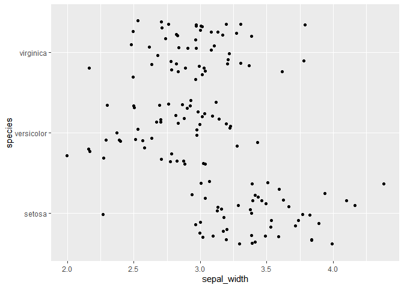
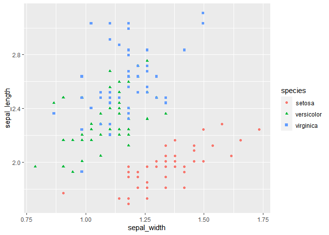
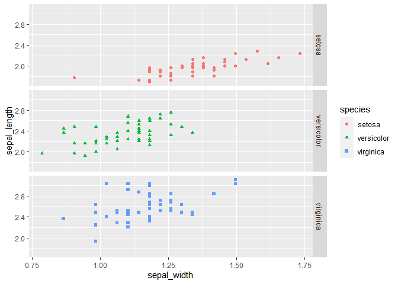

# Participation 2-13-2020


## Setting Up

### Error Allowance

<!---The following chunk allows errors when knitting--->


### Reminders
**When you make an Rmd file for participation or homework, be sure to do this**:

1. Change the file output to both html and md _documents_ (not notebook).
  - See the `keep_md: TRUE` argument above.

2. `knit` the document. 

3. Stage and commit the Rmd and knitted documents.

### Packages

```r
library(tidyverse)
library(gapminder)
# install.packages("tibble")
```
    

## Worksheet

### 1.

`select()`, `rename()`, `filter()`, `mutate()`, and a little plotting

Let's use the `mtcars` dataset. Complete the following tasks. Chain together
all of the commands in a task using the pipe `%>%`. Show the miles per gallon and horsepower for cars with 6 cylinders. Also convert the data frame to a tibble (keep the rownames and store them in the tibble with a descriptive variable name). Store this result as a new object with a descriptive object name.


```r
mtcars
```

```
##                      mpg cyl  disp  hp drat    wt  qsec vs am gear carb
## Mazda RX4           21.0   6 160.0 110 3.90 2.620 16.46  0  1    4    4
## Mazda RX4 Wag       21.0   6 160.0 110 3.90 2.875 17.02  0  1    4    4
## Datsun 710          22.8   4 108.0  93 3.85 2.320 18.61  1  1    4    1
## Hornet 4 Drive      21.4   6 258.0 110 3.08 3.215 19.44  1  0    3    1
## Hornet Sportabout   18.7   8 360.0 175 3.15 3.440 17.02  0  0    3    2
## Valiant             18.1   6 225.0 105 2.76 3.460 20.22  1  0    3    1
## Duster 360          14.3   8 360.0 245 3.21 3.570 15.84  0  0    3    4
## Merc 240D           24.4   4 146.7  62 3.69 3.190 20.00  1  0    4    2
## Merc 230            22.8   4 140.8  95 3.92 3.150 22.90  1  0    4    2
## Merc 280            19.2   6 167.6 123 3.92 3.440 18.30  1  0    4    4
## Merc 280C           17.8   6 167.6 123 3.92 3.440 18.90  1  0    4    4
## Merc 450SE          16.4   8 275.8 180 3.07 4.070 17.40  0  0    3    3
## Merc 450SL          17.3   8 275.8 180 3.07 3.730 17.60  0  0    3    3
## Merc 450SLC         15.2   8 275.8 180 3.07 3.780 18.00  0  0    3    3
## Cadillac Fleetwood  10.4   8 472.0 205 2.93 5.250 17.98  0  0    3    4
## Lincoln Continental 10.4   8 460.0 215 3.00 5.424 17.82  0  0    3    4
## Chrysler Imperial   14.7   8 440.0 230 3.23 5.345 17.42  0  0    3    4
## Fiat 128            32.4   4  78.7  66 4.08 2.200 19.47  1  1    4    1
## Honda Civic         30.4   4  75.7  52 4.93 1.615 18.52  1  1    4    2
## Toyota Corolla      33.9   4  71.1  65 4.22 1.835 19.90  1  1    4    1
## Toyota Corona       21.5   4 120.1  97 3.70 2.465 20.01  1  0    3    1
## Dodge Challenger    15.5   8 318.0 150 2.76 3.520 16.87  0  0    3    2
## AMC Javelin         15.2   8 304.0 150 3.15 3.435 17.30  0  0    3    2
## Camaro Z28          13.3   8 350.0 245 3.73 3.840 15.41  0  0    3    4
## Pontiac Firebird    19.2   8 400.0 175 3.08 3.845 17.05  0  0    3    2
## Fiat X1-9           27.3   4  79.0  66 4.08 1.935 18.90  1  1    4    1
## Porsche 914-2       26.0   4 120.3  91 4.43 2.140 16.70  0  1    5    2
## Lotus Europa        30.4   4  95.1 113 3.77 1.513 16.90  1  1    5    2
## Ford Pantera L      15.8   8 351.0 264 4.22 3.170 14.50  0  1    5    4
## Ferrari Dino        19.7   6 145.0 175 3.62 2.770 15.50  0  1    5    6
## Maserati Bora       15.0   8 301.0 335 3.54 3.570 14.60  0  1    5    8
## Volvo 142E          21.4   4 121.0 109 4.11 2.780 18.60  1  1    4    2
```


```r
mtcars_2 <- mtcars %>%
  as_tibble(rownames = "model") %>%
  filter(cyl == 6) %>%
  select(model, hp, mpg) %>% 
  rename("Model"="model","Horsepower"="hp", "MPG"="mpg") %>%
  print()
```

```
## # A tibble: 7 x 3
##   Model          Horsepower   MPG
##   <chr>               <dbl> <dbl>
## 1 Mazda RX4             110  21  
## 2 Mazda RX4 Wag         110  21  
## 3 Hornet 4 Drive        110  21.4
## 4 Valiant               105  18.1
## 5 Merc 280              123  19.2
## 6 Merc 280C             123  17.8
## 7 Ferrari Dino          175  19.7
```

### 2. 

Print the results from Task 1 in an appealing way by using `knitr::kable()`.


```r
knitr::kable(mtcars_2)
```


Model             Horsepower    MPG
---------------  -----------  -----
Mazda RX4                110   21.0
Mazda RX4 Wag            110   21.0
Hornet 4 Drive           110   21.4
Valiant                  105   18.1
Merc 280                 123   19.2
Merc 280C                123   17.8
Ferrari Dino             175   19.7

Let's use the `iris` dataset. Complete the following tasks. Chain together all of the commands in a task using the pipe `%>%`.


```r
iris
```

```
##     Sepal.Length Sepal.Width Petal.Length Petal.Width    Species
## 1            5.1         3.5          1.4         0.2     setosa
## 2            4.9         3.0          1.4         0.2     setosa
## 3            4.7         3.2          1.3         0.2     setosa
## 4            4.6         3.1          1.5         0.2     setosa
## 5            5.0         3.6          1.4         0.2     setosa
## 6            5.4         3.9          1.7         0.4     setosa
## 7            4.6         3.4          1.4         0.3     setosa
## 8            5.0         3.4          1.5         0.2     setosa
## 9            4.4         2.9          1.4         0.2     setosa
## 10           4.9         3.1          1.5         0.1     setosa
## 11           5.4         3.7          1.5         0.2     setosa
## 12           4.8         3.4          1.6         0.2     setosa
## 13           4.8         3.0          1.4         0.1     setosa
## 14           4.3         3.0          1.1         0.1     setosa
## 15           5.8         4.0          1.2         0.2     setosa
## 16           5.7         4.4          1.5         0.4     setosa
## 17           5.4         3.9          1.3         0.4     setosa
## 18           5.1         3.5          1.4         0.3     setosa
## 19           5.7         3.8          1.7         0.3     setosa
## 20           5.1         3.8          1.5         0.3     setosa
## 21           5.4         3.4          1.7         0.2     setosa
## 22           5.1         3.7          1.5         0.4     setosa
## 23           4.6         3.6          1.0         0.2     setosa
## 24           5.1         3.3          1.7         0.5     setosa
## 25           4.8         3.4          1.9         0.2     setosa
## 26           5.0         3.0          1.6         0.2     setosa
## 27           5.0         3.4          1.6         0.4     setosa
## 28           5.2         3.5          1.5         0.2     setosa
## 29           5.2         3.4          1.4         0.2     setosa
## 30           4.7         3.2          1.6         0.2     setosa
## 31           4.8         3.1          1.6         0.2     setosa
## 32           5.4         3.4          1.5         0.4     setosa
## 33           5.2         4.1          1.5         0.1     setosa
## 34           5.5         4.2          1.4         0.2     setosa
## 35           4.9         3.1          1.5         0.2     setosa
## 36           5.0         3.2          1.2         0.2     setosa
## 37           5.5         3.5          1.3         0.2     setosa
## 38           4.9         3.6          1.4         0.1     setosa
## 39           4.4         3.0          1.3         0.2     setosa
## 40           5.1         3.4          1.5         0.2     setosa
## 41           5.0         3.5          1.3         0.3     setosa
## 42           4.5         2.3          1.3         0.3     setosa
## 43           4.4         3.2          1.3         0.2     setosa
## 44           5.0         3.5          1.6         0.6     setosa
## 45           5.1         3.8          1.9         0.4     setosa
## 46           4.8         3.0          1.4         0.3     setosa
## 47           5.1         3.8          1.6         0.2     setosa
## 48           4.6         3.2          1.4         0.2     setosa
## 49           5.3         3.7          1.5         0.2     setosa
## 50           5.0         3.3          1.4         0.2     setosa
## 51           7.0         3.2          4.7         1.4 versicolor
## 52           6.4         3.2          4.5         1.5 versicolor
## 53           6.9         3.1          4.9         1.5 versicolor
## 54           5.5         2.3          4.0         1.3 versicolor
## 55           6.5         2.8          4.6         1.5 versicolor
## 56           5.7         2.8          4.5         1.3 versicolor
## 57           6.3         3.3          4.7         1.6 versicolor
## 58           4.9         2.4          3.3         1.0 versicolor
## 59           6.6         2.9          4.6         1.3 versicolor
## 60           5.2         2.7          3.9         1.4 versicolor
## 61           5.0         2.0          3.5         1.0 versicolor
## 62           5.9         3.0          4.2         1.5 versicolor
## 63           6.0         2.2          4.0         1.0 versicolor
## 64           6.1         2.9          4.7         1.4 versicolor
## 65           5.6         2.9          3.6         1.3 versicolor
## 66           6.7         3.1          4.4         1.4 versicolor
## 67           5.6         3.0          4.5         1.5 versicolor
## 68           5.8         2.7          4.1         1.0 versicolor
## 69           6.2         2.2          4.5         1.5 versicolor
## 70           5.6         2.5          3.9         1.1 versicolor
## 71           5.9         3.2          4.8         1.8 versicolor
## 72           6.1         2.8          4.0         1.3 versicolor
## 73           6.3         2.5          4.9         1.5 versicolor
## 74           6.1         2.8          4.7         1.2 versicolor
## 75           6.4         2.9          4.3         1.3 versicolor
## 76           6.6         3.0          4.4         1.4 versicolor
## 77           6.8         2.8          4.8         1.4 versicolor
## 78           6.7         3.0          5.0         1.7 versicolor
## 79           6.0         2.9          4.5         1.5 versicolor
## 80           5.7         2.6          3.5         1.0 versicolor
## 81           5.5         2.4          3.8         1.1 versicolor
## 82           5.5         2.4          3.7         1.0 versicolor
## 83           5.8         2.7          3.9         1.2 versicolor
## 84           6.0         2.7          5.1         1.6 versicolor
## 85           5.4         3.0          4.5         1.5 versicolor
## 86           6.0         3.4          4.5         1.6 versicolor
## 87           6.7         3.1          4.7         1.5 versicolor
## 88           6.3         2.3          4.4         1.3 versicolor
## 89           5.6         3.0          4.1         1.3 versicolor
## 90           5.5         2.5          4.0         1.3 versicolor
## 91           5.5         2.6          4.4         1.2 versicolor
## 92           6.1         3.0          4.6         1.4 versicolor
## 93           5.8         2.6          4.0         1.2 versicolor
## 94           5.0         2.3          3.3         1.0 versicolor
## 95           5.6         2.7          4.2         1.3 versicolor
## 96           5.7         3.0          4.2         1.2 versicolor
## 97           5.7         2.9          4.2         1.3 versicolor
## 98           6.2         2.9          4.3         1.3 versicolor
## 99           5.1         2.5          3.0         1.1 versicolor
## 100          5.7         2.8          4.1         1.3 versicolor
## 101          6.3         3.3          6.0         2.5  virginica
## 102          5.8         2.7          5.1         1.9  virginica
## 103          7.1         3.0          5.9         2.1  virginica
## 104          6.3         2.9          5.6         1.8  virginica
## 105          6.5         3.0          5.8         2.2  virginica
## 106          7.6         3.0          6.6         2.1  virginica
## 107          4.9         2.5          4.5         1.7  virginica
## 108          7.3         2.9          6.3         1.8  virginica
## 109          6.7         2.5          5.8         1.8  virginica
## 110          7.2         3.6          6.1         2.5  virginica
## 111          6.5         3.2          5.1         2.0  virginica
## 112          6.4         2.7          5.3         1.9  virginica
## 113          6.8         3.0          5.5         2.1  virginica
## 114          5.7         2.5          5.0         2.0  virginica
## 115          5.8         2.8          5.1         2.4  virginica
## 116          6.4         3.2          5.3         2.3  virginica
## 117          6.5         3.0          5.5         1.8  virginica
## 118          7.7         3.8          6.7         2.2  virginica
## 119          7.7         2.6          6.9         2.3  virginica
## 120          6.0         2.2          5.0         1.5  virginica
## 121          6.9         3.2          5.7         2.3  virginica
## 122          5.6         2.8          4.9         2.0  virginica
## 123          7.7         2.8          6.7         2.0  virginica
## 124          6.3         2.7          4.9         1.8  virginica
## 125          6.7         3.3          5.7         2.1  virginica
## 126          7.2         3.2          6.0         1.8  virginica
## 127          6.2         2.8          4.8         1.8  virginica
## 128          6.1         3.0          4.9         1.8  virginica
## 129          6.4         2.8          5.6         2.1  virginica
## 130          7.2         3.0          5.8         1.6  virginica
## 131          7.4         2.8          6.1         1.9  virginica
## 132          7.9         3.8          6.4         2.0  virginica
## 133          6.4         2.8          5.6         2.2  virginica
## 134          6.3         2.8          5.1         1.5  virginica
## 135          6.1         2.6          5.6         1.4  virginica
## 136          7.7         3.0          6.1         2.3  virginica
## 137          6.3         3.4          5.6         2.4  virginica
## 138          6.4         3.1          5.5         1.8  virginica
## 139          6.0         3.0          4.8         1.8  virginica
## 140          6.9         3.1          5.4         2.1  virginica
## 141          6.7         3.1          5.6         2.4  virginica
## 142          6.9         3.1          5.1         2.3  virginica
## 143          5.8         2.7          5.1         1.9  virginica
## 144          6.8         3.2          5.9         2.3  virginica
## 145          6.7         3.3          5.7         2.5  virginica
## 146          6.7         3.0          5.2         2.3  virginica
## 147          6.3         2.5          5.0         1.9  virginica
## 148          6.5         3.0          5.2         2.0  virginica
## 149          6.2         3.4          5.4         2.3  virginica
## 150          5.9         3.0          5.1         1.8  virginica
```


### 3.

Rename the variables to be all lowercase and to separate words with "_" instead of ".". Put the species name variable first. Store this result as a new object.


```r
iris_tidy <- iris %>%
  select("species"="Species",
         "sepal_length"="Sepal.Length", 
         "sepal_width"="Sepal.Width",
         "petal_length"="Petal.Length",
         "petal_width"="Petal.Width") %>%
  print()
```

```
##        species sepal_length sepal_width petal_length petal_width
## 1       setosa          5.1         3.5          1.4         0.2
## 2       setosa          4.9         3.0          1.4         0.2
## 3       setosa          4.7         3.2          1.3         0.2
## 4       setosa          4.6         3.1          1.5         0.2
## 5       setosa          5.0         3.6          1.4         0.2
## 6       setosa          5.4         3.9          1.7         0.4
## 7       setosa          4.6         3.4          1.4         0.3
## 8       setosa          5.0         3.4          1.5         0.2
## 9       setosa          4.4         2.9          1.4         0.2
## 10      setosa          4.9         3.1          1.5         0.1
## 11      setosa          5.4         3.7          1.5         0.2
## 12      setosa          4.8         3.4          1.6         0.2
## 13      setosa          4.8         3.0          1.4         0.1
## 14      setosa          4.3         3.0          1.1         0.1
## 15      setosa          5.8         4.0          1.2         0.2
## 16      setosa          5.7         4.4          1.5         0.4
## 17      setosa          5.4         3.9          1.3         0.4
## 18      setosa          5.1         3.5          1.4         0.3
## 19      setosa          5.7         3.8          1.7         0.3
## 20      setosa          5.1         3.8          1.5         0.3
## 21      setosa          5.4         3.4          1.7         0.2
## 22      setosa          5.1         3.7          1.5         0.4
## 23      setosa          4.6         3.6          1.0         0.2
## 24      setosa          5.1         3.3          1.7         0.5
## 25      setosa          4.8         3.4          1.9         0.2
## 26      setosa          5.0         3.0          1.6         0.2
## 27      setosa          5.0         3.4          1.6         0.4
## 28      setosa          5.2         3.5          1.5         0.2
## 29      setosa          5.2         3.4          1.4         0.2
## 30      setosa          4.7         3.2          1.6         0.2
## 31      setosa          4.8         3.1          1.6         0.2
## 32      setosa          5.4         3.4          1.5         0.4
## 33      setosa          5.2         4.1          1.5         0.1
## 34      setosa          5.5         4.2          1.4         0.2
## 35      setosa          4.9         3.1          1.5         0.2
## 36      setosa          5.0         3.2          1.2         0.2
## 37      setosa          5.5         3.5          1.3         0.2
## 38      setosa          4.9         3.6          1.4         0.1
## 39      setosa          4.4         3.0          1.3         0.2
## 40      setosa          5.1         3.4          1.5         0.2
## 41      setosa          5.0         3.5          1.3         0.3
## 42      setosa          4.5         2.3          1.3         0.3
## 43      setosa          4.4         3.2          1.3         0.2
## 44      setosa          5.0         3.5          1.6         0.6
## 45      setosa          5.1         3.8          1.9         0.4
## 46      setosa          4.8         3.0          1.4         0.3
## 47      setosa          5.1         3.8          1.6         0.2
## 48      setosa          4.6         3.2          1.4         0.2
## 49      setosa          5.3         3.7          1.5         0.2
## 50      setosa          5.0         3.3          1.4         0.2
## 51  versicolor          7.0         3.2          4.7         1.4
## 52  versicolor          6.4         3.2          4.5         1.5
## 53  versicolor          6.9         3.1          4.9         1.5
## 54  versicolor          5.5         2.3          4.0         1.3
## 55  versicolor          6.5         2.8          4.6         1.5
## 56  versicolor          5.7         2.8          4.5         1.3
## 57  versicolor          6.3         3.3          4.7         1.6
## 58  versicolor          4.9         2.4          3.3         1.0
## 59  versicolor          6.6         2.9          4.6         1.3
## 60  versicolor          5.2         2.7          3.9         1.4
## 61  versicolor          5.0         2.0          3.5         1.0
## 62  versicolor          5.9         3.0          4.2         1.5
## 63  versicolor          6.0         2.2          4.0         1.0
## 64  versicolor          6.1         2.9          4.7         1.4
## 65  versicolor          5.6         2.9          3.6         1.3
## 66  versicolor          6.7         3.1          4.4         1.4
## 67  versicolor          5.6         3.0          4.5         1.5
## 68  versicolor          5.8         2.7          4.1         1.0
## 69  versicolor          6.2         2.2          4.5         1.5
## 70  versicolor          5.6         2.5          3.9         1.1
## 71  versicolor          5.9         3.2          4.8         1.8
## 72  versicolor          6.1         2.8          4.0         1.3
## 73  versicolor          6.3         2.5          4.9         1.5
## 74  versicolor          6.1         2.8          4.7         1.2
## 75  versicolor          6.4         2.9          4.3         1.3
## 76  versicolor          6.6         3.0          4.4         1.4
## 77  versicolor          6.8         2.8          4.8         1.4
## 78  versicolor          6.7         3.0          5.0         1.7
## 79  versicolor          6.0         2.9          4.5         1.5
## 80  versicolor          5.7         2.6          3.5         1.0
## 81  versicolor          5.5         2.4          3.8         1.1
## 82  versicolor          5.5         2.4          3.7         1.0
## 83  versicolor          5.8         2.7          3.9         1.2
## 84  versicolor          6.0         2.7          5.1         1.6
## 85  versicolor          5.4         3.0          4.5         1.5
## 86  versicolor          6.0         3.4          4.5         1.6
## 87  versicolor          6.7         3.1          4.7         1.5
## 88  versicolor          6.3         2.3          4.4         1.3
## 89  versicolor          5.6         3.0          4.1         1.3
## 90  versicolor          5.5         2.5          4.0         1.3
## 91  versicolor          5.5         2.6          4.4         1.2
## 92  versicolor          6.1         3.0          4.6         1.4
## 93  versicolor          5.8         2.6          4.0         1.2
## 94  versicolor          5.0         2.3          3.3         1.0
## 95  versicolor          5.6         2.7          4.2         1.3
## 96  versicolor          5.7         3.0          4.2         1.2
## 97  versicolor          5.7         2.9          4.2         1.3
## 98  versicolor          6.2         2.9          4.3         1.3
## 99  versicolor          5.1         2.5          3.0         1.1
## 100 versicolor          5.7         2.8          4.1         1.3
## 101  virginica          6.3         3.3          6.0         2.5
## 102  virginica          5.8         2.7          5.1         1.9
## 103  virginica          7.1         3.0          5.9         2.1
## 104  virginica          6.3         2.9          5.6         1.8
## 105  virginica          6.5         3.0          5.8         2.2
## 106  virginica          7.6         3.0          6.6         2.1
## 107  virginica          4.9         2.5          4.5         1.7
## 108  virginica          7.3         2.9          6.3         1.8
## 109  virginica          6.7         2.5          5.8         1.8
## 110  virginica          7.2         3.6          6.1         2.5
## 111  virginica          6.5         3.2          5.1         2.0
## 112  virginica          6.4         2.7          5.3         1.9
## 113  virginica          6.8         3.0          5.5         2.1
## 114  virginica          5.7         2.5          5.0         2.0
## 115  virginica          5.8         2.8          5.1         2.4
## 116  virginica          6.4         3.2          5.3         2.3
## 117  virginica          6.5         3.0          5.5         1.8
## 118  virginica          7.7         3.8          6.7         2.2
## 119  virginica          7.7         2.6          6.9         2.3
## 120  virginica          6.0         2.2          5.0         1.5
## 121  virginica          6.9         3.2          5.7         2.3
## 122  virginica          5.6         2.8          4.9         2.0
## 123  virginica          7.7         2.8          6.7         2.0
## 124  virginica          6.3         2.7          4.9         1.8
## 125  virginica          6.7         3.3          5.7         2.1
## 126  virginica          7.2         3.2          6.0         1.8
## 127  virginica          6.2         2.8          4.8         1.8
## 128  virginica          6.1         3.0          4.9         1.8
## 129  virginica          6.4         2.8          5.6         2.1
## 130  virginica          7.2         3.0          5.8         1.6
## 131  virginica          7.4         2.8          6.1         1.9
## 132  virginica          7.9         3.8          6.4         2.0
## 133  virginica          6.4         2.8          5.6         2.2
## 134  virginica          6.3         2.8          5.1         1.5
## 135  virginica          6.1         2.6          5.6         1.4
## 136  virginica          7.7         3.0          6.1         2.3
## 137  virginica          6.3         3.4          5.6         2.4
## 138  virginica          6.4         3.1          5.5         1.8
## 139  virginica          6.0         3.0          4.8         1.8
## 140  virginica          6.9         3.1          5.4         2.1
## 141  virginica          6.7         3.1          5.6         2.4
## 142  virginica          6.9         3.1          5.1         2.3
## 143  virginica          5.8         2.7          5.1         1.9
## 144  virginica          6.8         3.2          5.9         2.3
## 145  virginica          6.7         3.3          5.7         2.5
## 146  virginica          6.7         3.0          5.2         2.3
## 147  virginica          6.3         2.5          5.0         1.9
## 148  virginica          6.5         3.0          5.2         2.0
## 149  virginica          6.2         3.4          5.4         2.3
## 150  virginica          5.9         3.0          5.1         1.8
```


### 4. 

Using the data from Task 3, plot the sepal width for each species. Perhaps use a boxplot or a jitter plot (or both overlaid!). Be sure to format the axis labels nicely.


```r
iris_tidy %>%
  ggplot(aes(x = sepal_width, y = species)) +
    geom_jitter() 
```

<!-- -->


### 5. 

`iris` expresses all of the measurements in centimeters. Convert them to inches (1 in = 2.54 cm). Store this dataset as a new object.


```r
iris_tidy_inches <- iris_tidy %>%
  mutate(sepal_length = sepal_length/2.54,
         sepal_width = sepal_width/2.54,
         petal_length = petal_length/2.54,
         petal_width = petal_width/2.54,) %>%
  print()
```

```
##        species sepal_length sepal_width petal_length petal_width
## 1       setosa     2.007874   1.3779528    0.5511811  0.07874016
## 2       setosa     1.929134   1.1811024    0.5511811  0.07874016
## 3       setosa     1.850394   1.2598425    0.5118110  0.07874016
## 4       setosa     1.811024   1.2204724    0.5905512  0.07874016
## 5       setosa     1.968504   1.4173228    0.5511811  0.07874016
## 6       setosa     2.125984   1.5354331    0.6692913  0.15748031
## 7       setosa     1.811024   1.3385827    0.5511811  0.11811024
## 8       setosa     1.968504   1.3385827    0.5905512  0.07874016
## 9       setosa     1.732283   1.1417323    0.5511811  0.07874016
## 10      setosa     1.929134   1.2204724    0.5905512  0.03937008
## 11      setosa     2.125984   1.4566929    0.5905512  0.07874016
## 12      setosa     1.889764   1.3385827    0.6299213  0.07874016
## 13      setosa     1.889764   1.1811024    0.5511811  0.03937008
## 14      setosa     1.692913   1.1811024    0.4330709  0.03937008
## 15      setosa     2.283465   1.5748031    0.4724409  0.07874016
## 16      setosa     2.244094   1.7322835    0.5905512  0.15748031
## 17      setosa     2.125984   1.5354331    0.5118110  0.15748031
## 18      setosa     2.007874   1.3779528    0.5511811  0.11811024
## 19      setosa     2.244094   1.4960630    0.6692913  0.11811024
## 20      setosa     2.007874   1.4960630    0.5905512  0.11811024
## 21      setosa     2.125984   1.3385827    0.6692913  0.07874016
## 22      setosa     2.007874   1.4566929    0.5905512  0.15748031
## 23      setosa     1.811024   1.4173228    0.3937008  0.07874016
## 24      setosa     2.007874   1.2992126    0.6692913  0.19685039
## 25      setosa     1.889764   1.3385827    0.7480315  0.07874016
## 26      setosa     1.968504   1.1811024    0.6299213  0.07874016
## 27      setosa     1.968504   1.3385827    0.6299213  0.15748031
## 28      setosa     2.047244   1.3779528    0.5905512  0.07874016
## 29      setosa     2.047244   1.3385827    0.5511811  0.07874016
## 30      setosa     1.850394   1.2598425    0.6299213  0.07874016
## 31      setosa     1.889764   1.2204724    0.6299213  0.07874016
## 32      setosa     2.125984   1.3385827    0.5905512  0.15748031
## 33      setosa     2.047244   1.6141732    0.5905512  0.03937008
## 34      setosa     2.165354   1.6535433    0.5511811  0.07874016
## 35      setosa     1.929134   1.2204724    0.5905512  0.07874016
## 36      setosa     1.968504   1.2598425    0.4724409  0.07874016
## 37      setosa     2.165354   1.3779528    0.5118110  0.07874016
## 38      setosa     1.929134   1.4173228    0.5511811  0.03937008
## 39      setosa     1.732283   1.1811024    0.5118110  0.07874016
## 40      setosa     2.007874   1.3385827    0.5905512  0.07874016
## 41      setosa     1.968504   1.3779528    0.5118110  0.11811024
## 42      setosa     1.771654   0.9055118    0.5118110  0.11811024
## 43      setosa     1.732283   1.2598425    0.5118110  0.07874016
## 44      setosa     1.968504   1.3779528    0.6299213  0.23622047
## 45      setosa     2.007874   1.4960630    0.7480315  0.15748031
## 46      setosa     1.889764   1.1811024    0.5511811  0.11811024
## 47      setosa     2.007874   1.4960630    0.6299213  0.07874016
## 48      setosa     1.811024   1.2598425    0.5511811  0.07874016
## 49      setosa     2.086614   1.4566929    0.5905512  0.07874016
## 50      setosa     1.968504   1.2992126    0.5511811  0.07874016
## 51  versicolor     2.755906   1.2598425    1.8503937  0.55118110
## 52  versicolor     2.519685   1.2598425    1.7716535  0.59055118
## 53  versicolor     2.716535   1.2204724    1.9291339  0.59055118
## 54  versicolor     2.165354   0.9055118    1.5748031  0.51181102
## 55  versicolor     2.559055   1.1023622    1.8110236  0.59055118
## 56  versicolor     2.244094   1.1023622    1.7716535  0.51181102
## 57  versicolor     2.480315   1.2992126    1.8503937  0.62992126
## 58  versicolor     1.929134   0.9448819    1.2992126  0.39370079
## 59  versicolor     2.598425   1.1417323    1.8110236  0.51181102
## 60  versicolor     2.047244   1.0629921    1.5354331  0.55118110
## 61  versicolor     1.968504   0.7874016    1.3779528  0.39370079
## 62  versicolor     2.322835   1.1811024    1.6535433  0.59055118
## 63  versicolor     2.362205   0.8661417    1.5748031  0.39370079
## 64  versicolor     2.401575   1.1417323    1.8503937  0.55118110
## 65  versicolor     2.204724   1.1417323    1.4173228  0.51181102
## 66  versicolor     2.637795   1.2204724    1.7322835  0.55118110
## 67  versicolor     2.204724   1.1811024    1.7716535  0.59055118
## 68  versicolor     2.283465   1.0629921    1.6141732  0.39370079
## 69  versicolor     2.440945   0.8661417    1.7716535  0.59055118
## 70  versicolor     2.204724   0.9842520    1.5354331  0.43307087
## 71  versicolor     2.322835   1.2598425    1.8897638  0.70866142
## 72  versicolor     2.401575   1.1023622    1.5748031  0.51181102
## 73  versicolor     2.480315   0.9842520    1.9291339  0.59055118
## 74  versicolor     2.401575   1.1023622    1.8503937  0.47244094
## 75  versicolor     2.519685   1.1417323    1.6929134  0.51181102
## 76  versicolor     2.598425   1.1811024    1.7322835  0.55118110
## 77  versicolor     2.677165   1.1023622    1.8897638  0.55118110
## 78  versicolor     2.637795   1.1811024    1.9685039  0.66929134
## 79  versicolor     2.362205   1.1417323    1.7716535  0.59055118
## 80  versicolor     2.244094   1.0236220    1.3779528  0.39370079
## 81  versicolor     2.165354   0.9448819    1.4960630  0.43307087
## 82  versicolor     2.165354   0.9448819    1.4566929  0.39370079
## 83  versicolor     2.283465   1.0629921    1.5354331  0.47244094
## 84  versicolor     2.362205   1.0629921    2.0078740  0.62992126
## 85  versicolor     2.125984   1.1811024    1.7716535  0.59055118
## 86  versicolor     2.362205   1.3385827    1.7716535  0.62992126
## 87  versicolor     2.637795   1.2204724    1.8503937  0.59055118
## 88  versicolor     2.480315   0.9055118    1.7322835  0.51181102
## 89  versicolor     2.204724   1.1811024    1.6141732  0.51181102
## 90  versicolor     2.165354   0.9842520    1.5748031  0.51181102
## 91  versicolor     2.165354   1.0236220    1.7322835  0.47244094
## 92  versicolor     2.401575   1.1811024    1.8110236  0.55118110
## 93  versicolor     2.283465   1.0236220    1.5748031  0.47244094
## 94  versicolor     1.968504   0.9055118    1.2992126  0.39370079
## 95  versicolor     2.204724   1.0629921    1.6535433  0.51181102
## 96  versicolor     2.244094   1.1811024    1.6535433  0.47244094
## 97  versicolor     2.244094   1.1417323    1.6535433  0.51181102
## 98  versicolor     2.440945   1.1417323    1.6929134  0.51181102
## 99  versicolor     2.007874   0.9842520    1.1811024  0.43307087
## 100 versicolor     2.244094   1.1023622    1.6141732  0.51181102
## 101  virginica     2.480315   1.2992126    2.3622047  0.98425197
## 102  virginica     2.283465   1.0629921    2.0078740  0.74803150
## 103  virginica     2.795276   1.1811024    2.3228346  0.82677165
## 104  virginica     2.480315   1.1417323    2.2047244  0.70866142
## 105  virginica     2.559055   1.1811024    2.2834646  0.86614173
## 106  virginica     2.992126   1.1811024    2.5984252  0.82677165
## 107  virginica     1.929134   0.9842520    1.7716535  0.66929134
## 108  virginica     2.874016   1.1417323    2.4803150  0.70866142
## 109  virginica     2.637795   0.9842520    2.2834646  0.70866142
## 110  virginica     2.834646   1.4173228    2.4015748  0.98425197
## 111  virginica     2.559055   1.2598425    2.0078740  0.78740157
## 112  virginica     2.519685   1.0629921    2.0866142  0.74803150
## 113  virginica     2.677165   1.1811024    2.1653543  0.82677165
## 114  virginica     2.244094   0.9842520    1.9685039  0.78740157
## 115  virginica     2.283465   1.1023622    2.0078740  0.94488189
## 116  virginica     2.519685   1.2598425    2.0866142  0.90551181
## 117  virginica     2.559055   1.1811024    2.1653543  0.70866142
## 118  virginica     3.031496   1.4960630    2.6377953  0.86614173
## 119  virginica     3.031496   1.0236220    2.7165354  0.90551181
## 120  virginica     2.362205   0.8661417    1.9685039  0.59055118
## 121  virginica     2.716535   1.2598425    2.2440945  0.90551181
## 122  virginica     2.204724   1.1023622    1.9291339  0.78740157
## 123  virginica     3.031496   1.1023622    2.6377953  0.78740157
## 124  virginica     2.480315   1.0629921    1.9291339  0.70866142
## 125  virginica     2.637795   1.2992126    2.2440945  0.82677165
## 126  virginica     2.834646   1.2598425    2.3622047  0.70866142
## 127  virginica     2.440945   1.1023622    1.8897638  0.70866142
## 128  virginica     2.401575   1.1811024    1.9291339  0.70866142
## 129  virginica     2.519685   1.1023622    2.2047244  0.82677165
## 130  virginica     2.834646   1.1811024    2.2834646  0.62992126
## 131  virginica     2.913386   1.1023622    2.4015748  0.74803150
## 132  virginica     3.110236   1.4960630    2.5196850  0.78740157
## 133  virginica     2.519685   1.1023622    2.2047244  0.86614173
## 134  virginica     2.480315   1.1023622    2.0078740  0.59055118
## 135  virginica     2.401575   1.0236220    2.2047244  0.55118110
## 136  virginica     3.031496   1.1811024    2.4015748  0.90551181
## 137  virginica     2.480315   1.3385827    2.2047244  0.94488189
## 138  virginica     2.519685   1.2204724    2.1653543  0.70866142
## 139  virginica     2.362205   1.1811024    1.8897638  0.70866142
## 140  virginica     2.716535   1.2204724    2.1259843  0.82677165
## 141  virginica     2.637795   1.2204724    2.2047244  0.94488189
## 142  virginica     2.716535   1.2204724    2.0078740  0.90551181
## 143  virginica     2.283465   1.0629921    2.0078740  0.74803150
## 144  virginica     2.677165   1.2598425    2.3228346  0.90551181
## 145  virginica     2.637795   1.2992126    2.2440945  0.98425197
## 146  virginica     2.637795   1.1811024    2.0472441  0.90551181
## 147  virginica     2.480315   0.9842520    1.9685039  0.74803150
## 148  virginica     2.559055   1.1811024    2.0472441  0.78740157
## 149  virginica     2.440945   1.3385827    2.1259843  0.90551181
## 150  virginica     2.322835   1.1811024    2.0078740  0.70866142
```


### 6.

Using the data from Task 5, plot the relationship between sepal width and sepal length. Indicate species using color and point shape.


```r
iris_tidy_inches %>%
  ggplot(aes(x = sepal_width, y = sepal_length)) +
    geom_point(aes(color = species, shape = species))
```

<!-- -->


### 7.

Using the data from Task 5, plot the relationship between sepal width and sepal length. This time, separate each species into a different subplot (facet).


```r
iris_tidy_inches %>%
  ggplot(aes(x = sepal_width, y = sepal_length)) +
    geom_point(aes(color = species, shape = species)) +
  facet_grid(rows = vars(species))
```

<!-- -->


<br><br>

## Back to Guide Again

Let's head back to the guide at the section on `summarize()`.

<br><br>


## Exercises for grouped data frames

Let's do some practice with grouping (and ungrouping) and summarizing data frames!


### 1.

   (a) What's the minimum life expectancy for each continent and each year? 
   (b) Add the corresponding country to the tibble, too. 
   (c) Arrange by min life expectancy.


```r
gapminder %>% 
  group_by(continent, year) %>% 
  summarize(min_life = min(lifeExp)) %>%
  arrange(min_life) %>%
  transmute(min_life_decade = round(min_life, -1))
```

```
## # A tibble: 60 x 2
## # Groups:   continent [5]
##    continent min_life_decade
##    <fct>               <dbl>
##  1 Africa                 20
##  2 Asia                   30
##  3 Africa                 30
##  4 Asia                   30
##  5 Asia                   30
##  6 Africa                 30
##  7 Asia                   30
##  8 Africa                 30
##  9 Asia                   30
## 10 Africa                 30
## # ... with 50 more rows
```


### 2.

Let's compute the mean Agreeableness score across items for each participant  in the `psych::bfi` dataset. Be sure to handle `NA`!


```r
psych::bfi
```

```
## Error in loadNamespace(name): there is no package called 'psych'
```


```r
psych::bfi %>%
  as_tibble() %>%
  select(A1:A5) %>%
  rowwise() %>%
  mutate(A_Mean = mean(c(A1, A2, A3, A4, A5), na.rm = TRUE))
```

```
## Error in loadNamespace(name): there is no package called 'psych'
```

Now compute mean scores for Conscientiousness, as well as `sd` and `min` scores for reach person.


```r
psych::bfi %>%
  as_tibble() %>%
  select(C1:C5) %>%
  rowwise() %>%
  mutate(C_Mean = mean(c(C1, C2, C3, C4, C5), na.rm = TRUE), 
         C_SD = sd(c(C1, C2, C3, C4, C5), na.rm = TRUE), 
         C_Min = min(c(C1, C2, C3, C4, C5), na.rm = TRUE))
```

```
## Error in loadNamespace(name): there is no package called 'psych'
```

Some functions are **vectorized**, so you don't need `rowwise()`. 
For example, `pmin()` computes the "parallel min" across the vectors it receives:


```r
psych::bfi %>%
  as_tibble() %>%
  select(C1:C5) %>%
  pmin()
```

```
## Error in loadNamespace(name): there is no package called 'psych'
```

**There are a few other ways to do this sort of computation.**

`rowMeans()` computes the mean of each row of a data frame. We can use it by
putting `select()` inside of `mutate()`:


**In the development version of `dplyr`, there are some functions to make**
**this approach easier.**

```
remotes::install_github("tidyverse/dplyr")
```


### 3.
Let's use `psych::bfi` and make a new data frame that has (1) each participant's educational level (convert it to a categorical variable using `factor*()`) and the mean score for each of the Big Five scales for each participant. Store this data frame as a new object.
   

```r
psych_2 <- psych::bfi %>%
  as_tibble() %>%
  select(A1:A5, C1:C5, E1:E5, N1:N5, O1:O5, education) %>%
  mutate(education = factor(education)) %>%
  rowwise() %>%
  mutate(A_Mean = mean(c(A1, A2, A3, A4, A5), na.rm = TRUE), 
         C_Mean = mean(c(C1, C2, C3, C4, C5), na.rm = TRUE), 
         E_Mean = mean(c(E1, E2, E3, E4, E5), na.rm = TRUE),
         N_Mean = mean(c(N1, N2, N3, N4, N5), na.rm = TRUE), 
         O_Mean = mean(c(O1, O2, O3, O4, O5), na.rm = TRUE)) %>%
  ungroup() %>% 
  print()
```

```
## Error in loadNamespace(name): there is no package called 'psych'
```
